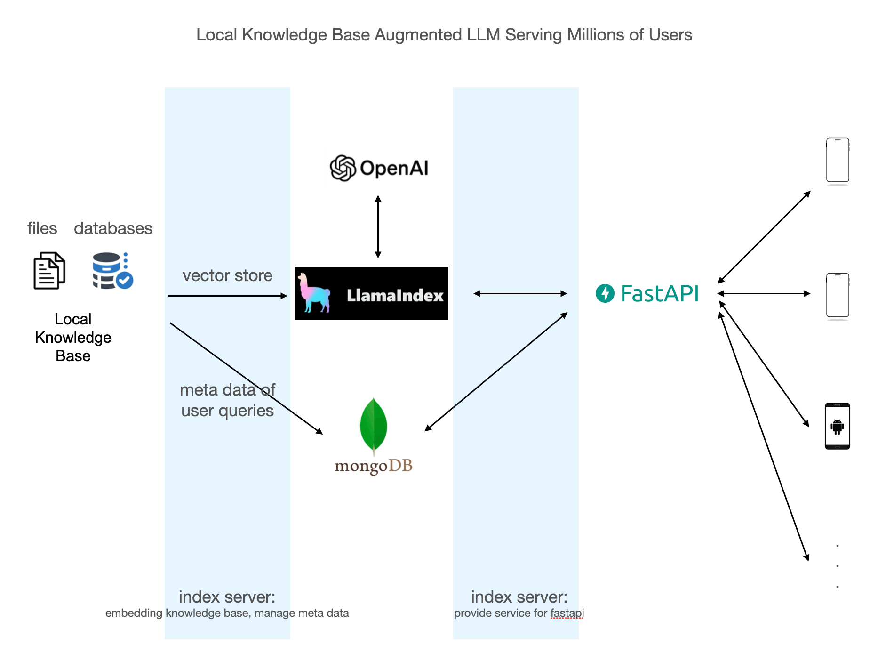
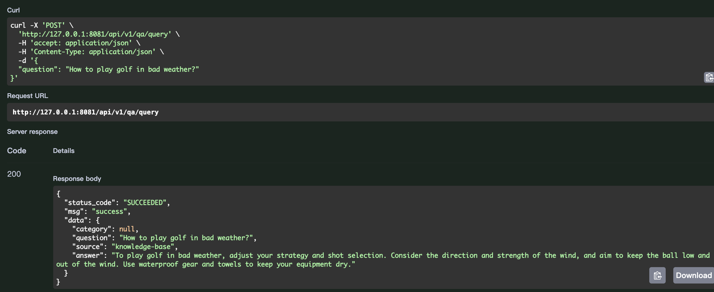
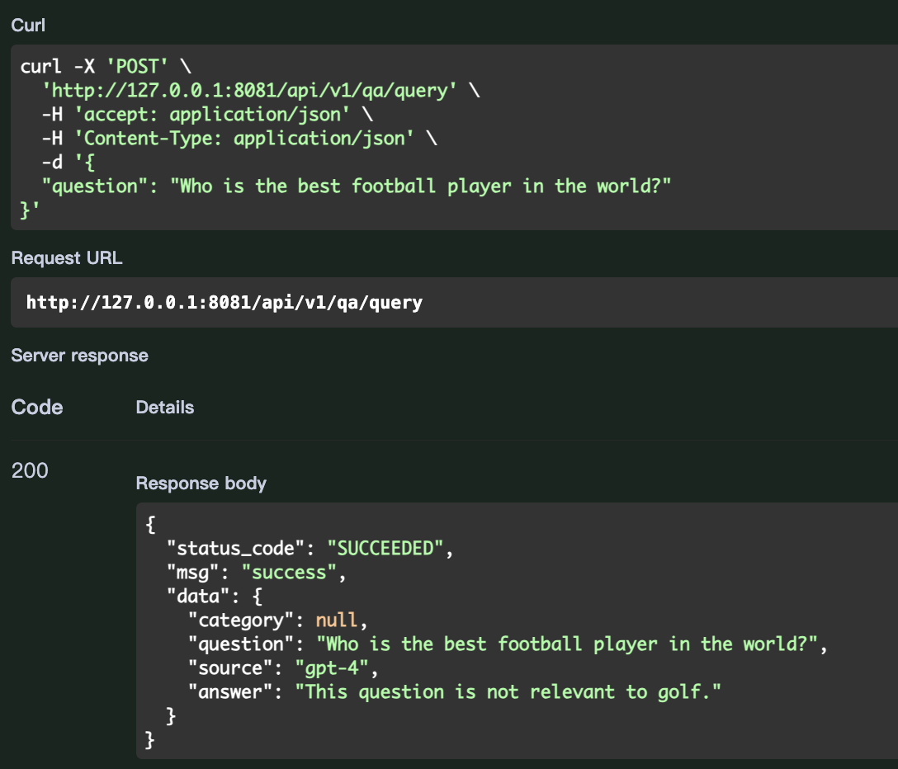

# FastLlama: Local Knowledge Base Augmented LLM

This project leverages a Local Knowledge Base augmented with a Language Model (LLM) to provide scalable question-answering capabilities for millions of users. Built on top of **LlamaIndex**, **FastAPI**, and **MongoDB**, the system supports two operational modes: Question Answering and Chatbot.



## Modes of Operation

### 1. Question Answering Mode

In this mode, the bot utilizes a local knowledge base sourced from a CSV file containing standard question/answer pairs. The operational flow is as follows:

- **Data Ingestion**: Upon the first execution, the CSV file is ingested. Standard questions are vectorized using **LlamaIndex**, which serves as the embedding engine. Standard answers are stored in **MongoDB**. This decoupling allows for flexibility and efficient data retrieval.
  
- **Query Processing**: When a user poses a question:
  - The query engine searches for a matching question in the local database. If a match is found, the corresponding answer is retrieved from MongoDB.
  - If no suitable match exists, the bot queries OpenAI's ChatGPT API to obtain an answer and stores the new question in the index for future reference.
  
- **Relevance Check**: If the question does not pertain to the designated topic (in this implementation, Golf), the bot will decline to provide an answer.

### 2. Chatbot Mode

Currently under development, the Chatbot Mode aims to allow the bot to respond to a broader range of questions, irrespective of the specific topic. It will also enable the extraction of relevant information from chat history.

#### Interaction Examples

- **Knowledge Base Interaction**  
  

- **Irrelevant Question Handling**  
  

## System Architecture Overview

The bot operates within a robust architecture comprising:

- **FastAPI**: The chosen web framework, providing high performance and asynchronous capabilities.
- **LlamaIndex**: Serves as the search engine, facilitating efficient vector embeddings.
- **MongoDB**: Utilized for metadata storage, ensuring quick retrieval of answers.

### Technical Implementation

- **Embedding Process**: Utilizes the OpenAI API at `https://api.openai.com/v1/embeddings` for high-performance embeddings. The process is both cost-effective and efficient.
  
- **Answer Retrieval**: Queries OpenAI's ChatGPT for answers via `https://api.openai.com/v1/chat/completions`, defaulting to the `gpt-3.5-turbo` model for its response generation.

- **Concurrency Support**: The system is designed to handle concurrent requests natively, ensuring scalability for multiple users.

## Future Enhancements

- Integrate OpenAI's Assistant API as a potential alternative search engine (current trials indicate that LlamaIndex outperforms it at this time).
- Develop additional test cases to enhance reliability and performance.

## Development Instructions

### Environment Setup

To set up the development environment, follow these steps:

```bash
export OPENAI_API_KEY=your_openai_api_key 
pyenv install 3.11.8 
virtualenv -p python3.11 env
source env/bin/activate
pip install -r requirements.txt
```

### Running Unit Tests

Execute the following command to run unit tests:

```bash
pytest -ss
```

### Starting the Server

To start the FastAPI server, use:

```bash
uvicorn app.main:app --host 127.0.0.1 --port 8081
# Alternatively, run with:
# PYTHONPATH=. python app/main.py 8082
```

### API Documentation

Access the automatically generated API documentation at:

```plaintext
http://127.0.0.1:8081/docs
```

To generate OpenAPI documentation, use:

```bash
PYTHONPATH=. python app/utils/api-docs/extract_openapi.py app.main:app --out openapi.yaml
python app/utils/api-docs/swagger_html.py < openapi.yaml > swagger.html
python app/utils/api-docs/redoc_html.py < openapi.yaml > redoc.html
```

### Local Testing Guidelines

- Write test cases in files located at `/app/tests/test_*.py`.
- Ensure all local test cases pass before committing any changes.

## References

- [LlamaIndex Official Documentation: Fullstack App Guide](https://docs.llamaindex.ai/en/stable/understanding/putting_it_all_together/apps/fullstack_app_guide.html)
- [LlamaIndex Official Demo Code: Flask + React](https://github.com/logan-markewich/llama_index_starter_pack/tree/main/flask_react)